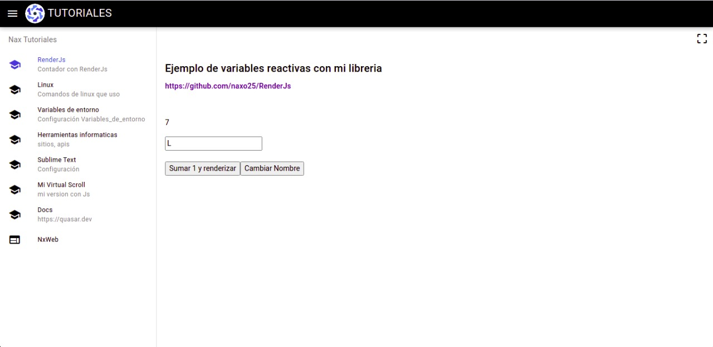

# RenderJs

Lbrería que estoy haciendo para manejar el estado global y renderizar el estado con Js.
Adicionalmente en la plantilla uso la cdn de VueJS y Vue-router para renderizar html como componentes similar a Jsx.

### Herramientas usadas

* JavaScript para la librería
* VueJs
* Vue-Router

### Uso

[Importa la cdn](./js/RenderJs.js)

Declara una variable global

Destructura la función reactiva pasando como parametros el valor y la clase o id como [aquí](https://github.com/naxo25/RenderJs/blob/0.1/js/store.js#L143)
```
const [ home, setHome ] = setReactive(5,'Home')
```

Crea un componente para renderizar y añadelo al router, en este caso use vue-router, elige el que prefieras

En el boton esta el evento onclick que llama a la funcion para actualizar el valor.

```
myComponent() {
  const component = '<p class="Home">` + home + `</p>'
  return (`
    <div>
      `+ component +`
      <button onclick='setHome(1)'> Sumar 1 y renderizar </button>
    </div>
  `)
};
const MyComponent = { template: myComponent }

const routes = [ { path: '/', component: MyComponent };
```

Llama a la funcion myRender() que es la que observa los cambios en el Dom al cambiar de página
<!-- ```
``` página
```
``` -->
*Esta es la versión inicial*

### Ejemplo

[https://nacholabraweb.000webhostapp.com/tutoriales](https://nacholabraweb.000webhostapp.com/tutoriales)



## Github 📌

Uso [GIT](https://git-scm.com/) para control de versiones.
Puedes ver los comandos que uso [aqui](https://nacholabraweb.000webhostapp.com/tutoriales)

Agradecimientos al equipo de github por tener este proyecto en la nube.

## Licencia 📄

Proyecto bajo Licencia (MIT)
App desarrollada por Ignacio Labra
